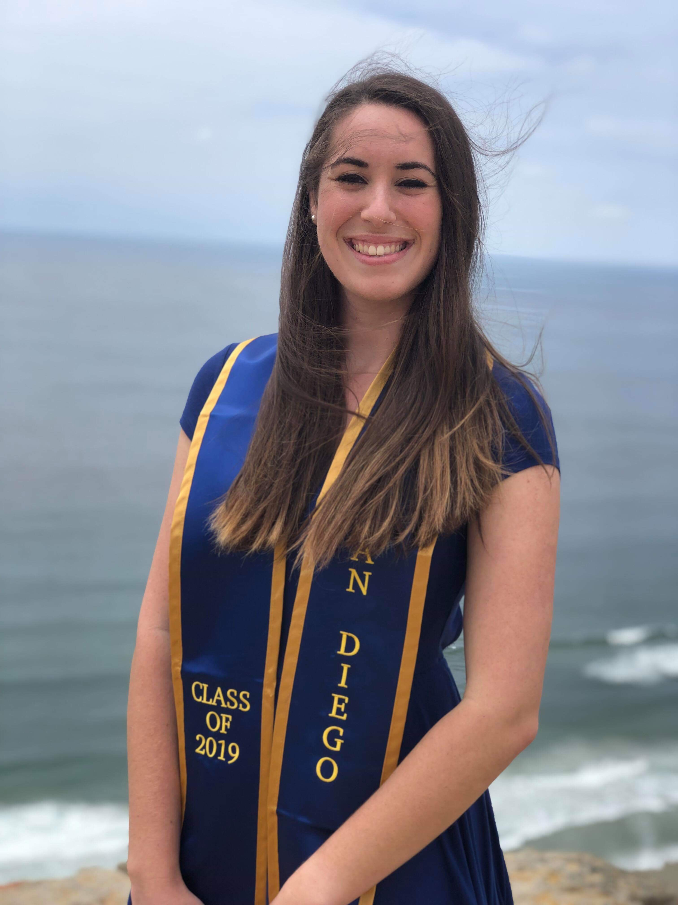

\  

## Summary
Research scientist looking to utilize my computational skills in the field of population biology/ecology/evolution/genetics. My experience includes topics in ecology, evolution, math, computer programming, biotechnology, and surface chemistry. In graduate school at UC San Diego, I was researching life history and decision-making strategies, conducting laboratory research on nematodes, and developing an extensive model in Python to simulate the life cycles and interactions of a worm population. Following graduation, I began building upon my data science journey through the organization, Metis, and completed half a dozen projects on various topics including machine learning, linear regression, and data engineering. During that time, I also started working at Illumina where I conduct research as part of the surface chemistry team in the Materials and Applied Surface Sciences department, and contribute towards the development of new DNA sequencing technologies. I’m a prospective PhD student hoping to combine my technical skills in both scientific and computational disciplines.

{height=330px width=250px}

\  

## Contact
- [LinkedIn](https://www.linkedin.com/in/rachel-goodridge/)
- [GitHub](https://github.com/RachelGoodridge)
- RachelGoodridge@yahoo.com
